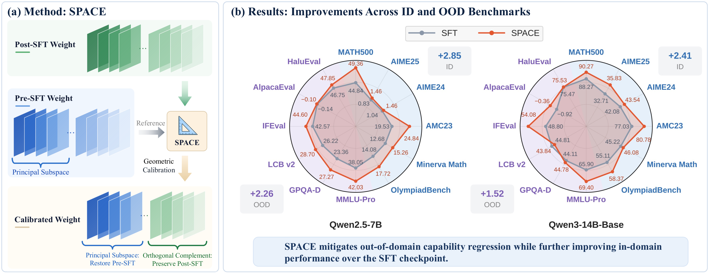

<h1 align="center">SPACE: Geometric Calibration<br>of Supervised Fine-Tuning</h1>

<p align="center">
  Jianzhu&nbsp;Bao<sup>1</sup> &ensp;
  Jia-Chen&nbsp;Gu<sup>2</sup> &ensp;
  Qingyuan&nbsp;Liu<sup>1</sup> &ensp;
  Haozhen&nbsp;Zhang<sup>1</sup>
  <br>
  Kai-Wei&nbsp;Chang<sup>2</sup> &ensp;
  Nanyun&nbsp;Peng<sup>2</sup> &ensp;
  Wenya&nbsp;Wang<sup>1</sup>
</p>

<p align="center">
  <sup>1</sup> Nanyang Technological University<br>
  <sup>2</sup> University of California, Los Angeles
</p>

<p align="center">
  <a href="https://www.ntu.edu.sg/">
    
  </a>
  &emsp;
  <a href="https://www.ucla.edu/">
    
  </a>
</p>

<p align="center">
  <a href="https://jianzhubao.github.io/SPACE/" title="SPACE project page">
    
  </a>
  <!-- &nbsp; -->
  <!-- TODO: Add href="ARXIV_URL" to this anchor when the paper is available. -->
  <a title="arXiv link coming soon">
    
  </a>
</p>

## 📖 Overview

Supervised fine-tuning (SFT) adapts LLMs to target tasks but can compromise their broader capabilities.
Recent studies investigate the weight geometry of LLMs through spectral structure, which characterizes how the weights transform different input directions.
Within this view, SFT induces dense updates that perturb the spectral geometry of the pre-SFT weights along principal directions.
These directions span a principal subspace that is considered to carry much of the model's prior or transferable knowledge.

This raises a simple question: can an SFT checkpoint be improved by removing the learned updates within these principal subspaces?
More generally, the geometry of the pre-SFT weights may provide a useful reference for refining completed SFT updates.
We study this perspective as *Geometric Calibration* and develop **SPACE (Subspace Projection for Adapted Checkpoint Enhancement)**, a lightweight post-hoc method that selectively reverts SFT update components within the principal subspace of the pre-SFT weights while preserving those in its orthogonal complement.
SPACE is a data-free, training-free method that requires only the pre- and post-SFT checkpoints.

Experiments show that SPACE mitigates out-of-domain (OOD) capability regression while further improving in-domain (ID) performance over the uncalibrated SFT checkpoints.



## 🚀 Get Started

### Installation

The calibration package requires **Python 3.10+**. Install it from the repository
root:

```bash
pip install .
```

This installs the public API in [`src/space_calibration`](src/space_calibration).
Training and evaluation dependencies are installed separately under
[`Experiments`](#-experiments).

### Calibrate a checkpoint

Provide the original pre-SFT checkpoint, its fine-tuned checkpoint, and a new
output directory:

```python
from space_calibration import space_calibrate

output_dir = space_calibrate(
    pre_sft="Qwen/Qwen2.5-7B",
    post_sft="./sft-checkpoint",
    output_dir="./space-checkpoint",
    rho=0.5,
    alpha=1.0,
    device="auto",
)
```

`pre_sft` and `post_sft` accept local Hugging Face checkpoint directories or Hub
model IDs. The pre-SFT checkpoint should be the model used to initialize SFT.
Full, unquantized safetensors checkpoints are supported, including sharded
checkpoints.

| Parameter | Default | Description |
| --- | --- | --- |
| `rho` | `0.5` | Selects the smallest principal subspace capturing at least this fraction of the pre-SFT matrix's **squared singular-value energy**. |
| `alpha` | `1.0` | Controls how much of the SFT update is removed within the selected subspace. `1.0` removes it fully; `0.0` leaves the SFT weights unchanged. |
| `device` | `"auto"` | Device used for calibration: `"cpu"`, `"cuda"`, or `"cuda:0"`, for example. `"auto"` uses CUDA when available. |

Both `rho` and `alpha` are in `[0, 1]`. Calibration applies to all two-dimensional
weight matrices; other tensors are copied from the SFT checkpoint.

The same operation is available through the CLI:

```bash
space-calibrate \
  --pre Qwen/Qwen2.5-7B \
  --post ./sft-checkpoint \
  --output ./space-checkpoint \
  --rho 0.5 --alpha 1.0 --device auto
```

## 🧪 Experiments

The experiment workflow consists of **data preparation → SFT → SPACE calibration
→ evaluation**. Each stage has a shell script and can run
independently. With an existing SFT checkpoint, start directly from calibration.

The evaluation suite supports the following benchmarks:

| Evaluation | Benchmarks |
| --- | --- |
| In-domain (math) | MATH-500, Minerva Math, OlympiadBench, AIME24, AIME25, AMC23 |
| Out-of-domain | MMLU-Pro, GPQA-Diamond, LiveCodeBench v2, IFEval, AlpacaEval RM, HaluEval |

### Environment setup

Experiments use a separate **Python 3.12** environment with pinned training and
evaluation dependencies. From the repository root, run:

```bash
cd experiments
bash scripts/install.sh

# Select the GPUs available for training and evaluation.
export CUDA_VISIBLE_DEVICES=0,1,2,3
```

The installation script
uses `uv`, initializes the evaluation submodules, and prepares the experiment
environment.

### Qwen2.5-7B

Full-parameter SFT on **100,000 NuminaMath-CoT examples**, followed by
SPACE calibration. The default training run finishes at **step 390**.

```bash
# Prepare training and evaluation data.
bash scripts/qwen2.5-7b/prepare.sh

# Train and calibrate the SFT checkpoint.
bash scripts/qwen2.5-7b/train.sh
bash scripts/qwen2.5-7b/calibrate.sh

# Evaluate SFT and SPACE using the enabled benchmark commands.
bash scripts/qwen2.5-7b/eval.sh \
  checkpoints/qwen2.5-7b/sft/global_step_390/huggingface
bash scripts/qwen2.5-7b/eval.sh \
  checkpoints/qwen2.5-7b/space/global_step_390
```

Evaluation results are saved to
`experiments/checkpoints/qwen2.5-7b/{sft,space}/eval_results/global_step_390/`,
with a subdirectory for each benchmark.

### Qwen3-14B-Base

Full-parameter SFT on **Math-CoT-20k (20,480 examples)**, followed by SPACE
calibration. The default training run finishes at **step 80**.
Evaluation uses 1,000 randomly sampled MMLU-Pro test examples and 1,000 examples
from each HaluEval subset (QA, dialogue, and summarization), sampled with seed 42.

```bash
# Prepare training and evaluation data, including the seed-42 OOD subsets.
bash scripts/qwen3-14b-base/prepare.sh

# Train and calibrate the SFT checkpoint.
bash scripts/qwen3-14b-base/train.sh
bash scripts/qwen3-14b-base/calibrate.sh

# Evaluate SFT and SPACE using the enabled benchmark commands.
bash scripts/qwen3-14b-base/eval.sh \
  checkpoints/qwen3-14b-base/sft/global_step_80/huggingface
bash scripts/qwen3-14b-base/eval.sh \
  checkpoints/qwen3-14b-base/space/global_step_80
```

Evaluation results are saved to
`experiments/checkpoints/qwen3-14b-base/{sft,space}/eval_results/global_step_80/`,
with a subdirectory for each benchmark.

Each `eval.sh` runs its uncommented benchmark commands. Enable the desired
benchmarks in that script before evaluation. `calibrate.sh [SFT_CHECKPOINT]
[SPACE_OUTPUT]` accepts an existing checkpoint and an optional output directory;
for checkpoints named `global_step_N`, the default SPACE output uses the same
step N. `eval.sh CHECKPOINT [OUTPUT_DIR]` accepts an optional evaluation directory.

## 📁 Repository Structure

```text
SPACE/
├── assets/                     # Overview figure and university logos
├── site/                       # Static project page and preview instructions
├── src/space_calibration/       # Core method, checkpoint API, and CLI
├── examples/                   # Minimal API example
├── experiments/
│   ├── configs/                # Dataset sources and revisions
│   ├── src/space/              # Data preparation and evaluation utilities
│   ├── scripts/
│   │   ├── qwen2.5-7b/         # Prepare, train, calibrate, evaluate
│   │   ├── qwen3-14b-base/     # Prepare, train, calibrate, evaluate
│   │   └── eval/               # Individual benchmark launchers
│   ├── verl/                   # Training framework snapshot
│   ├── math_evaluation/        # Mathematical reasoning evaluation
│   ├── lm-evaluation-harness/  # Pinned evaluation submodule
│   ├── livecodebench/          # Pinned coding evaluation submodule
│   ├── pyproject.toml
│   └── uv.lock
├── pyproject.toml
└── uv.lock
```

See [site/README.md](site/README.md) to preview or publish the project page.

The method package and experiment project use separate environments. Experiments
install `space_calibration` from the repository root, sharing the same method
implementation as the public API.

## 🙏 Acknowledgments

We thank the authors and maintainers of
[Qwen2.5-Math](https://github.com/QwenLM/Qwen2.5-Math),
[lm-evaluation-harness](https://github.com/EleutherAI/lm-evaluation-harness), and
[LiveCodeBench](https://github.com/LiveCodeBench/LiveCodeBench) for their open-source
evaluation tools and benchmarks. Our experiments also build on
[verl](https://github.com/verl-project/verl) for training and
[vLLM](https://github.com/vllm-project/vllm) for inference.

We also thank the authors of [DFT](https://github.com/yongliang-wu/DFT),
[ASFT](https://github.com/zhuchichi56/ASFT),
[ReThink](https://github.com/Nebularaid2000/rethink_sft_generalization), and
[RPSFT](https://github.com/jinhangzhan/RPSFT) for sharing their code and experimental
protocols, which provided valuable references for our work.

## 📄 License

SPACE's own code is released under the [Apache License 2.0](LICENSE).
Third-party code and datasets retain their original licenses.
